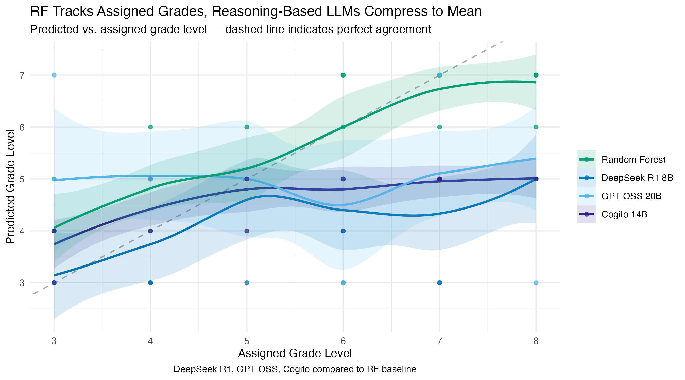
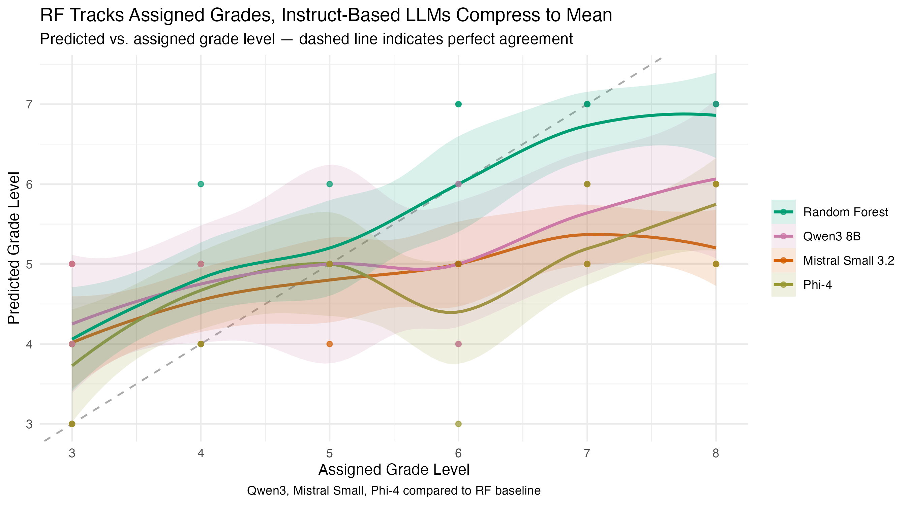
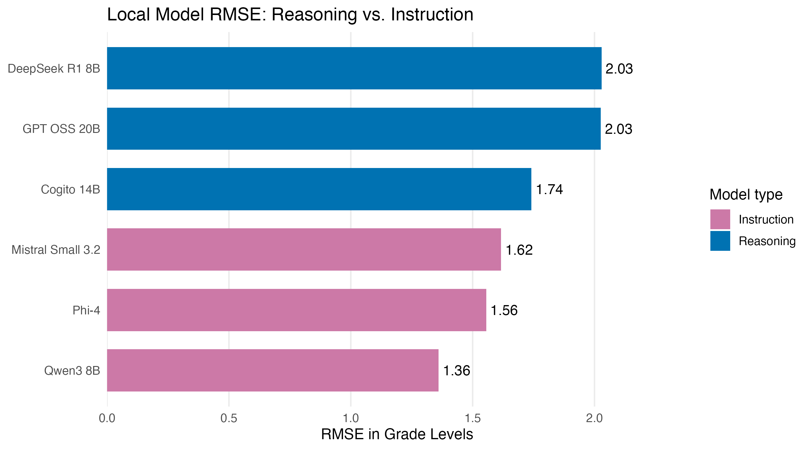

# Are New York State ELA Test Reading Passages Robust to LLM Scrutiny?
*By Howell Lu, Ruiting Shen, Thomas Szymanski*

For young New Yorkers, the New York State Test (NYST) is a substantial part of the grade 3-8 experience. Some students may realize much of their curriculum is painstakingly curated to prepare them for these assessments, yet many never grasp the full weight of their results. Annually, these scores are used to evaluate schools, districts, and, in some schools, individual teachers' performance evaluations. Given these high stakes, it is worth asking: how robust is the design of these tests, and do the passages actually reflect the grade-level complexity they're assigned to?

To address this, we conducted a case study of English Language Arts (ELA) reading passages, aiming to establish a parallel grade-level benchmark based on reading complexity. By comparing these parallel metrics against the official assigned levels, we could evaluate the robustness of the exams. We used Large Language Models (LLMs) as our primary analytical tool, supplemented by a machine-learning approach trained on traditional readability metrics to triangulate findings.

Traditional metrics like Flesch-Kincaid (sentence length/syllables), Dale-Chall (difficult word ratio), and Corrected Type-Token Ratio (CTTR; unique word ratio) provide benchmarks for reading complexity. We scored 2024 and 2025 passages using these metrics, training a Random Forest model on 2024 data to predict 2025 grade levels. Random Forest handles non-linear relationships and correlated predictors well, allowing it to combine these overlapping readability metrics.

For LLM evaluation, we used a zero-shot, structured chain-of-thought prompt via a Python (3.9.6) script, analyzing results in R (ggplot2 4.0.3). We tested Claude Opus 4.5 via API (cost: ~$0.41) and six local models via Ollama (ran on 32GB VRAM), organized into two groups: **reasoning models** (deepseek-r1:8b, gpt-oss:20b, cogito:14b) and **instruction models** (qwen3:8b, mistral-small3.2:latest, phi4). While we intended for Opus to yield our flagship findings, we incorporated local models to investigate whether smaller models could reasonably approximate its results, and whether reasoning-oriented architectures would outperform standard instruction-tuned models on this task.

  
*Figure 1. Both Random Forest and Claude Opus 4.5 systematically diverge from assigned grade levels, transitioning from overestimation to underestimation between grades 5 and 6. While the Random Forest maintains closer alignment, Claude Opus 4.5 plateaus near grade 5 and diverges further as assigned complexity increases.*

Figure 1 shows predicted grade level against assigned grade level, where the dashed diagonal line represents perfect agreement with the grade level each reading passage was tested under.

Claude Opus 4.5 diverged substantially from the assigned grade levels. It modestly overestimated complexity for grade 3-4 passages, tracked closely around grade 5, then progressively underestimated complexity from grade 6 onward — plateauing near grade 5 even for passages assigned to grade 8.

The Random Forest model came closer to preserving the direction of the grade-level scale. Its predictions generally increased as assigned grade level increased, signaling that traditional readability metrics were conducive to modest divergence with the assigned grade level. However, the model also showed a compression pattern: it tended to overestimate lower-grade passages and underestimate higher-grade passages. In fact, Random Forest overestimated the grade level of lower-grade passages to an even greater extent than Opus did. Conversely, it underestimated the grade level of upper-grade passages to a lesser extent, and did not display a plateauing behavior.

  
*Figure 2a. Reasoning-oriented local models (DeepSeek R1 8B, GPT OSS 20B, Cogito 14B) compared to the Random Forest baseline. Note: DeepSeek R1 and GPT OSS results are based on 26/31 and 29/31 passages respectively due to parse errors on the remaining passages.*

  
*Figure 2b. Instruction-tuned local models (Qwen3 8B, Mistral Small 3.2, Phi-4) compared to the Random Forest baseline. Qwen3 results are based on 20/31 passages due to parse errors.*

Figures 2a and 2b plot predicted against assigned grade levels for the six local models, organized by architecture type. Three models — deepseek-r1:8b (5 passages), gpt-oss:20b (2 passages), and qwen3:8b (11 passages) — produced empty responses on a subset of passages, likely due to exhausting the output token budget within their internal reasoning or thinking blocks before reaching the final answer line. These passages are excluded from the RMSE calculations below.

Among the reasoning models, all three displayed the compression pattern observed in Figure 1, though with greater overall error than Opus. Cogito 14B was the most consistent of the group. Among instruction models, Phi-4 and Mistral Small 3.2 performed closest to Opus, while Qwen3's incomplete results make a fair comparison difficult.

  
*Figure 3. RMSE by model across all methods. Random Forest achieves the lowest error (0.98), followed by Claude Opus 4.5 (1.50). Among local models, Phi-4 (1.56) and Mistral Small 3.2 (1.62) come closest to Opus. Note that RMSE for DeepSeek R1, GPT OSS, and Qwen3 is computed on incomplete passage sets.*

The overall error comparison quantifies the patterns observed in Figures 1 and 2. Random Forest had the lowest RMSE (0.98), making it the benchmark that converged most closely to the assigned grade levels. Claude Opus 4.5 followed at 1.50. Among local models, the instruction-tuned Phi-4 (1.56) and Mistral Small 3.2 (1.62) performed closest to Opus — a notable result given they ran entirely on consumer hardware at no API cost. Cogito 14B (1.74) was the strongest of the reasoning models on complete data. The higher RMSE values for DeepSeek R1 (2.03, 26 passages) and GPT OSS (2.03, 29 passages) should be interpreted cautiously given their incomplete passage coverage.

  
*Figure 4. RMSE for reasoning vs. instruction local models. Instruction-tuned models outperformed reasoning models on this task on average, though the comparison is complicated by incomplete data for some reasoning models.*

Across all eight models, predicted grade levels diverged systematically from assigned grade levels — a compression toward the middle of the scale that intensified for higher-grade passages. This pattern is consistent with regression to the mean: when a model lacks a strong signal to distinguish grade levels, predictions gravitate toward the center of the distribution, producing overestimation of lower grades and underestimation of higher grades throughout. Admittedly, part of the gap also reflects what readability metrics and LLMs cannot see, such as knowledge demands. For the LLM results specifically, prompt sensitivity is a meaningful limitation: the zero-shot chain-of-thought prompt used here is one of many possible approaches, and an optimized prompt may have yielded meaningfully different grade-level estimates. Nonetheless, the consistency of the divergence — even from a Random Forest trained on another year's assigned labels — suggests that the quantitative complexity signal in NYST ELA passages does not cleanly stratify by grade. This is worth examining further given the stakes attached to the test.

*Source data: https://www.nysedregents.org/ei/ei-ela.html*
