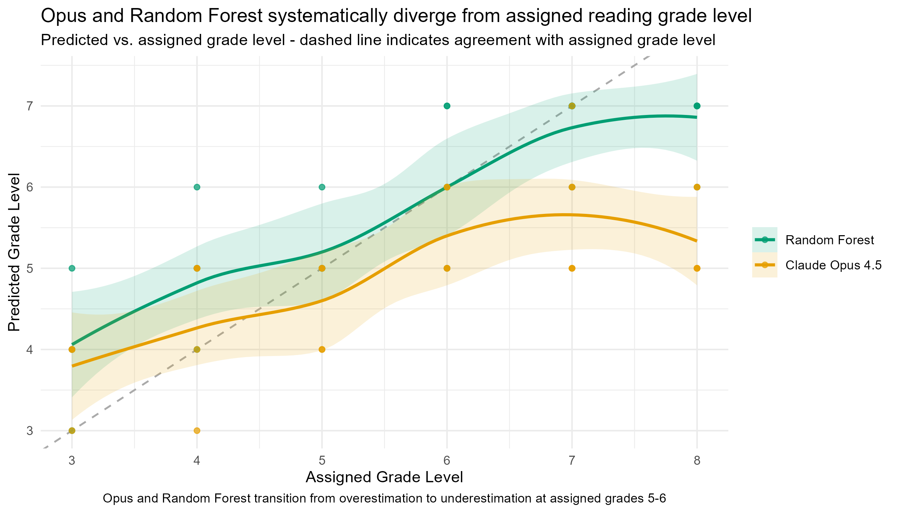
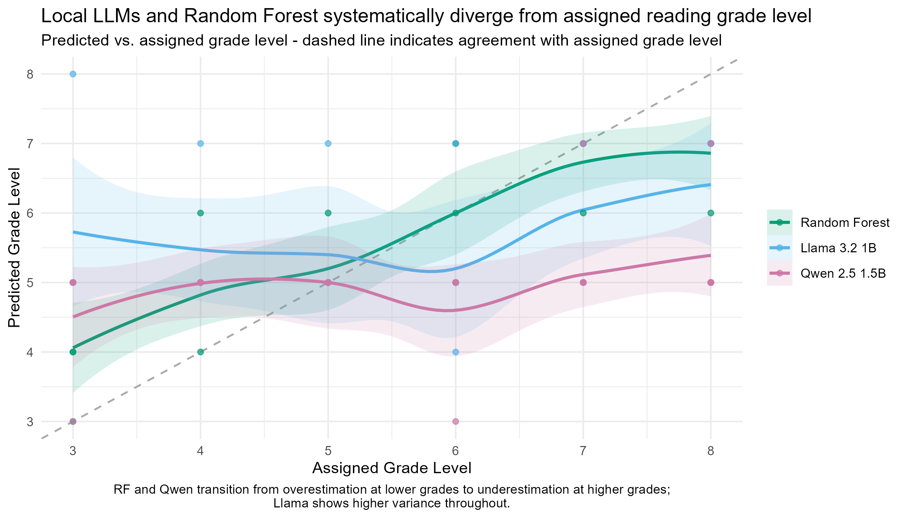
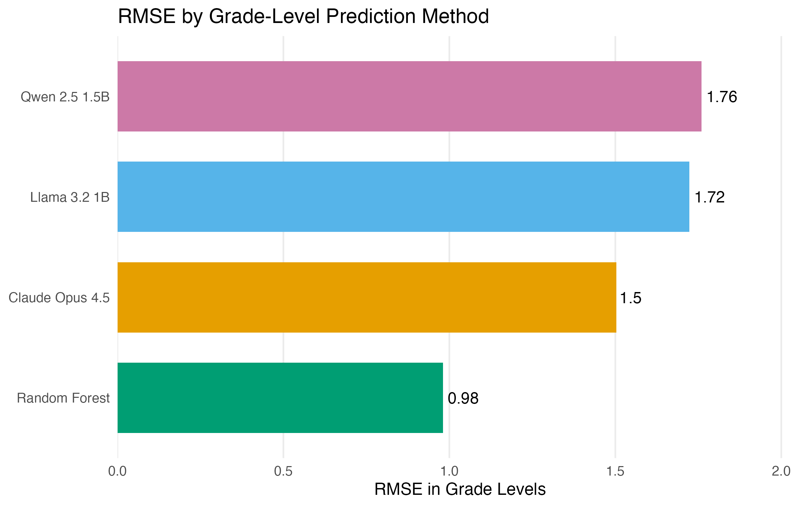

# Are New York State ELA Test Reading Passages Robust to LLM Scrutiny?
*By Howell Lu, Ruiting Shen, Thomas Szymanski*

For young New Yorkers, the New York State Test (NYST) is a substantial part of the grade 3-8 experience. Some students may realize much of their curriculum is painstakingly curated to prepare them for these assessments, yet many never grasp the full weight of their results. Annually, these scores are used to evaluate schools, districts, and, in some schools, individual teachers' performance evaluations. Given these high stakes, it is worth asking: how robust is the design of these tests, and do the passages actually reflect the grade-level complexity they're assigned to?

To address this, we conducted a case study of English Language Arts (ELA) reading passages, aiming to establish a parallel grade-level benchmarks based on reading complexity. By comparing these parallel metrics against the official assigned levels, we could evaluate the robustness of the exams. We used Large Language Models (LLMs) as our primary analytical tool, supplemented by a machine-learning approach trained on traditional readability metrics to triangulate findings.

Traditional metrics like Flesch-Kincaid (sentence length/syllables), Dale-Chall (difficult word ratio), and Corrected Type-Token Ratio (CTTR; unique word ratio) provide benchmarks for reading complexity. We scored 2024 and 2025 passages using these metrics, training a Random Forest model on 2024 data to predict 2025 grade levels. Random Forest handles non-linear relationships and correlated predictors well, allowing it to combine these overlapping readability metrics.

For LLM evaluation, we used a zero-shot, structured chain-of-thought prompt via a Python (3.9.6) script, analyzing results in R (ggplot2 4.0.3). We tested Claude Opus 4.5 via API (cost: ~$0.41) and three local models via Ollama (M4 MacBook Air, 32GB): qwen2.5:1.5b, llama3.2:1b, and deepseek-r1:1.5b. While we intended for Opus to yield our flagship findings, we incorporated local models to investigate whether smaller models could reasonably approximate its results.

  
*Figure 1. Both Random Forest and Claude Opus 4.5 systematically diverge from assigned grade levels, transitioning from overestimation to underestimation between grades 5 and 6. While the Random Forest maintains closer alignment, Claude Opus 4.5 plateaus near grade 5 and diverges further as assigned complexity increases.*

Figure 1 shows predicted grade level against assigned grade level, where the dashed diagonal line represents perfect agreement with the grade level each reading passage was tested under.

Claude Opus 4.5 diverged substantially from the assigned grade levels. It modestly overestimated complexity for grade 3-4 passages, tracked closely around grade 5, then progressively underestimated complexity from grade 6 onward - plateauing near grade 5 even for passages assigned to grade 8.

The Random Forest model came closer to preserving the direction of the grade-level scale. Its predictions generally increased as assigned grade level increased, signaling that traditional readability metrics were conducive to modest divergence with the assigned grade level. However, the model also showed a compression pattern: it tended to overestimate lower-grade passages and underestimate higher-grade passages. In fact, Random Forest overestimated the grade level of lower-grade passages to an even greater extent than Opus did. Conversely, it underestimated the grade level of upper-grade passages to a lesser extent; in doing so, not displaying a plateuing behavior.

  
*Figure 2. Local LLMs and Random Forest systematically diverge from assigned reading grade level. The dashed line shows perfect agreement. Random Forest and qwen2.5:1.5B tend to overestimate lower-grade passages and underestimate higher-grade passages, while llama3.2:1B shows higher variance throughout.*

Figure 2 plots similarly predicted against assigned grade levels, with the dashed diagonal representing perfect agreement.

Deepseek-r1:1.5b failed the task due to repeated parse errors. Llama3.2:1b showed high variance, while qwen2.5:1.5b defaulted to grade 5 for most passages. This pattern raised a question about whether the smaller models were discriminating between passages or collapsing toward a central value. To investigate Qwen’s unilateral output, we tested (1) a larger (qwen3:8b) Qwen model, (2) qwen2.5:1.5b at temperature 0.3, and (3) qwen2.5:1.5b with a truncated prompt. Both the larger model and temperature-adjusted version mirrored earlier patterns, while the truncated prompt led to systematic underprediction.

  
*Figure 3. Random Forest had the lowest overall prediction error, followed by Claude Opus 4.5. The smaller local LLMs had higher RMSE, with Qwen2.5:1.5B showing the highest RMSE.*

The overall error comparison makes the patterns observed across Figures 1 and 2 clearer. Figure 3 compares models using RMSE, where lower values mean the model’s predictions were closer to the assigned grade levels. Random Forest had the lowest RMSE, making it the benchmark in our analysis that converged most closely to the assigned grade levels.

As indicated before, the smaller local LLMs displayed the most substantial divergence. llama3.2:1B had a higher RMSE than Claude and Random Forest, consistent with the variability shown in Figure 1. Qwen2.5:1.5B had the highest RMSE, matching its tendency to predict a narrow range of grade levels rather than adjusting to the structural variation of the data.

Across all four models, predicted grade levels diverged systematically from assigned grade levels — a compression toward the middle of the scale that intensified for higher-grade passages. This pattern is consistent with regression to the mean: when a model lacks a strong signal to distinguish grade levels, predictions gravitate toward the center of the distribution, producing the overestimation of lower grades and underestimation of higher grades observed throughout. Admittedly, part of the gap also reflects what readability metrics and LLMs cannot see, such as knowledge demands. For the LLM results specifically, prompt sensitivity is a meaningful limitation: the zero-shot chain-of-thought prompt used here is one of many possible approaches, and an optimized prompt may have yielded meaningfully different grade-level estimates. Nonetheless, the consistency of the divergence — even from a Random Forest trained on another year's assigned labels — suggests that the quantitative complexity signal in NYST ELA passages does not cleanly stratify by grade. This is worth examining further given the stakes attached to the test.

*Source data: https://www.nysedregents.org/ei/ei-ela.html*
